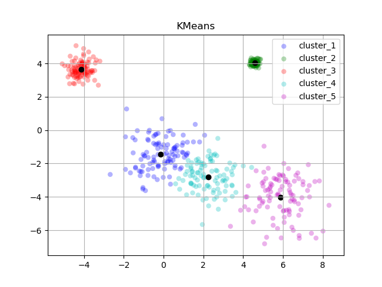

# KMeans-clustering 

## About
This repo implements simple k-means clustering.

## Test
    conda env create -f environment.yml
    conda activate kmeans
    python test.py -n_clusters 5 -n_points 100 
    # After the above commands, look into the `result` dir to check the generated result

## TimeFrame 
For algorithmic implementation : `45min`    
For visualization codes : `1 hour`

## Code Explanation 
-   `test.py` generates `-n_points` number of data points for `-n_cluters` number of 2 dimensional multivariate gaussian distributions.
The parameters for each distribution, mean and covariance, is random-sampled but cross-dimensional variances are set to be `0` for its visual tidiness. 

-   The generated data points and its sampled gaussian distributions will be visualized under the name of `result/raw.png` and `result/gaussian.png` respectively.

-   After data generation, the `KMeans` runs on the data and its `labels` and `centorids` will be plotted under the name of `result/kmeans.png`

-   To compare the `Gaussian` and `KMeans` together, please refer to the `result/final.png` which concatenates every generated pngs.